# 🎭 Sentiment Analyser App: End-to-End MLOps & Production EKS Pipeline

[](https://www.python.org/downloads/release/python-3100/)
[](https://dvc.org/)
[](https://mlflow.org/)
[](https://dagshub.com/)
[](https://www.docker.com/)
[](https://aws.amazon.com/eks/)
[](https://prometheus.io/)
[](https://grafana.com/)

A production-oriented **MLOps Sentiment Analysis System** for classifying IMDB movie reviews as positive or negative.

This repository demonstrates a complete, automated machine learning lifecycle covering **data versioning (DVC)**, **reproducible pipelines**, **experiment tracking (MLflow/DagsHub)**, **automated quality-gate model promotion**, **non-root Docker packaging**, **4-stage GitHub Actions CI/CD**, **AWS EKS Kubernetes deployment**, and **real-time observability with Prometheus & Grafana**.

---

## 📌 Table of Contents

- [🌟 Overview](#-overview)
- [🏗️ End-to-End Architecture](#️-end-to-end-architecture)
- [⚙️ Technology Stack](#️-technology-stack)
- [🔄 Machine Learning & DVC Pipeline](#-machine-learning--dvc-pipeline)
- [🧪 Experiment Tracking & Automated Model Promotion](#-experiment-tracking--automated-model-promotion)
- [🐳 Docker Containerization](#-docker-containerization)
- [☁️ AWS EKS Infrastructure & Kubernetes Deployment](#️-aws-eks-infrastructure--kubernetes-deployment)
- [🚀 4-Stage CI/CD Pipeline](#-4-stage-cicd-pipeline)
- [📊 Observability & Monitoring (Prometheus & Grafana)](#-observability--monitoring-prometheus--grafana)
- [📁 Repository Structure](#-repository-structure)
- [🔐 Environment Variables & Kubernetes Secrets](#-environment-variables--kubernetes-secrets)
- [🧹 AWS Resource Cleanup](#-aws-resource-cleanup)

---

## 🌟 Overview

This system implements a production-ready sentiment analysis platform using the **IMDB movie review dataset**.

### Key Workflow Principles:
$$\text{Commit} \longrightarrow \text{Validate} \longrightarrow \text{Train} \longrightarrow \text{Evaluate} \longrightarrow \text{Promote} \longrightarrow \text{Build} \longrightarrow \text{Deploy} \longrightarrow \text{Monitor}$$

---

## 🏗️ End-to-End Architecture

```mermaid
flowchart LR
    A[👨‍💻 Developer] -->|Git Commit & Push| B[📦 GitHub Repository]
    B --> C[⚡ GitHub Actions CI/CD]
    
    subgraph CI_CD [GitHub Actions 4-Stage Pipeline]
        C --> D[1️⃣ DVC Repro & Model Tests]
        D -->|Pass| E[2️⃣ Flask Tests & Quality Gate]
        E -->|Pass & Promote| F[3️⃣ Build Docker Image]
        F --> G[Upload to AWS ECR]
        G --> H[4️⃣ Deploy to AWS EKS]
    end
    
    H --> I[☁️ AWS EKS Cluster: sentiment-analyser-capstone-app]
    I --> J[☸️ Flask Pods - 2 Replicas]
    J --> K[🌐 AWS LoadBalancer Service]
    
    K --> L[📊 /metrics Endpoint]
    L --> M[🔥 Prometheus Scraper]
    M --> N[📈 Grafana Dashboard]

    O[☁️ AWS S3 Remote] -.->|Data Versioning| D
    P[🏷️ DagsHub MLflow] -.->|Model Registry| E
```



---

## ⚙️ Technology Stack

| Layer | Technology Used | Description |
| :--- | :--- | :--- |
| **Language** | Python 3.10 / 3.11 | Core runtime environment |
| **ML Framework** | Scikit-Learn | TF-IDF Vectorizer + LogisticRegression / LinearSVC |
| **NLP Preprocessing** | NLTK | Stopwords & WordNet lemmatization |
| **Data Versioning** | DVC | Pipeline reproducibility & dataset versioning |
| **Remote Storage** | AWS S3 | Cloud backend for DVC versioned datasets |
| **Experiment Tracking** | MLflow & DagsHub | Remote metric logging & Model Registry |
| **Web API** | Flask | Inference REST API (`/predict` & `/metrics`) |
| **WSGI Server** | Gunicorn | Production multi-worker WSGI server |
| **Containerization** | Docker | Non-root security container (`python:3.10-slim`) |
| **Container Registry** | AWS ECR | Storage for container image (`capstone_proj:latest`) |
| **Kubernetes** | Amazon EKS | Managed cluster (`sentiment-analyser-capstone-app`) |
| **Provisioning CLI** | `eksctl` & `kubectl` | Infrastructure as Code & cluster orchestration |
| **CI/CD Automation** | GitHub Actions | 4-stage automated pipeline (`.github/workflows/ci.yaml`) |
| **Metrics Collector** | Prometheus | Telemetry collection via `prometheus_client` |
| **Dashboards** | Grafana | Operational PromQL monitoring dashboards |

---

## 🔄 Machine Learning & DVC Pipeline

The ML pipeline processes raw text reviews into numerical feature vectors to train a binary classifier:

$$\text{Raw Review} \longrightarrow \text{Text Preprocessing} \longrightarrow \text{TF-IDF Vectorization} \longrightarrow \text{Classifier (LogisticRegression/LinearSVC)} \longrightarrow \text{Sentiment (Positive/Negative)}$$

### DVC Data Lineage
Data versioning ensures that code and datasets remain decoupled while maintaining 100% reproducibility:

```powershell
# Reproduce entire ML pipeline
dvc repro

# Check DVC pipeline status
dvc status

# Push versioned data to AWS S3 remote
dvc push
```

---

## 🧪 Experiment Tracking & Automated Model Promotion

All training runs, hyperparameters, evaluation metrics (`accuracy`, `precision`, `recall`, `f1_score`, `auc`), and vectorizer binaries are logged to **MLflow on DagsHub**.

### Automated Quality Gate (`scripts/promote_model.py`)
Model promotion is governed by quantitative unit tests rather than manual deployment:

```
[ Candidate Model ] ──► [ Unit Tests (basic_tests/test_model.py) ]
                              │
                              ├── FAIL ──► ❌ Reject Candidate
                              │
                              └── PASS ──► 🏆 Promote to MLflow Production Registry
```

When candidate models satisfy evaluation thresholds, `promote_model.py` atomically transitions the version to `Production` stage in the MLflow Model Registry.

---

## 🐳 Docker Containerization

The web application is packaged as a lightweight, production-grade Docker image using security best practices:

- **Base Image**: `python:3.10-slim`
- **Security User**: Non-root system user (`capstone_user`, UID 1000)
- **Production Server**: Gunicorn (`0.0.0.0:5000` with 120s timeout)
- **Pre-baked Datasets**: NLTK `stopwords` and `wordnet` downloaded globally

```powershell
# Build Docker image locally
docker build -t capstone_proj:latest .

# Run Docker container locally
docker run -p 5000:5000 -e CAPSTONE_TEST=<YOUR_DAGSHUB_TOKEN> capstone_proj:latest
```

---

## ☁️ AWS EKS Infrastructure & Kubernetes Deployment

The application runs on Amazon Elastic Kubernetes Service (**EKS**) provisioned via `eksctl`:

- **Cluster Name**: `sentiment-analyser-capstone-app`
- **Region**: `us-east-1`
- **Worker Node Group**: Managed EC2 Node Group (`t3.small` instances, `--nodes 1 --nodes-min 0 --nodes-max 2`)

```yaml
# deployment.yaml Highlights:
spec:
  replicas: 2
  containers:
    - name: flask-app
      image: <AWS_ACCOUNT_ID>.dkr.ecr.us-east-1.amazonaws.com/capstone_proj:latest
      imagePullPolicy: Always
      resources:
        requests: { memory: "256Mi", cpu: "250m" }
        limits:   { memory: "512Mi", cpu: "1" }
      readinessProbe:
        httpGet: { path: "/", port: 5000 }
      livenessProbe:
        httpGet: { path: "/", port: 5000 }
```

---

## 🚀 4-Stage CI/CD Pipeline

The GitHub Actions workflow ([`.github/workflows/ci.yaml`](file:///.github/workflows/ci.yaml)) automates testing, model promotion, image building, and EKS deployment:

1. **Stage 1 — Pipeline & Model Testing**: Runs `dvc repro`, executes candidate model unit tests, and uploads `vectorizer.pkl` artifacts.
2. **Stage 2 — Flask Testing & Model Promotion**: Downloads artifacts, tests Staging model endpoints, and executes `promote_model.py` on `main` branch.
3. **Stage 3 — Docker Build & ECR Push**: Logs into AWS ECR, builds the container image, and pushes `capstone_proj:latest`.
4. **Stage 4 — EKS Deployment**: Authenticates with AWS, updates `kubeconfig`, applies Kubernetes secrets (`capstone-secret`), and deploys `deployment.yaml` and `service.yaml`.

---

## 📊 Observability & Monitoring (Prometheus & Grafana)

The Flask app uses `prometheus_client` to expose metrics on `/metrics`:

- **`app_request_count_total`**: Counter of HTTP requests by method & endpoint.
- **`app_request_latency_seconds`**: Histogram of request latency.
- **`model_prediction_count_total`**: Counter of predictions by sentiment class.
- **`empty_input_request_count_total`**: Counter of invalid input requests.

### PromQL Aggregation Queries
Because the LoadBalancer routes scrapes across 2 pod replicas, queries use `sum()` aggregation:

```promql
# Total Requests across all replicas
sum(app_request_count_total)

# Request rate per minute
sum(rate(app_request_count_total[1m]))
```

---

## 📁 Repository Structure

```text
mlops_capstone_project/
├── .github/
│   └── workflows/
│       └── ci.yaml               # 4-Stage GitHub Actions Workflow
├── basic_tests/
│   ├── test_model.py         # Candidate Model Quality Gate Unit Tests
│   └── test_flask_app.py     # Flask Web App Integration Tests
├── capstone_src/
│   ├── constants/            # Project Constants & Configurations
│   ├── data/                 # Ingestion & Preprocessing Modules
│   ├── features/             # TF-IDF Feature Extraction
│   └── models/               # Training, Evaluation & Registration
├── flask_app/
│   ├── app.py                # Production Flask App & Prometheus Telemetry
│   ├── load_model.py         # Dynamic MLflow Registry Model Loader
│   └── templates/            # HTML Web UI Templates
├── scripts/
│   └── promote_model.py      # Staging -> Production Model Promotion Script
├── deployment.yaml           # Kubernetes Deployment Manifest (2 Replicas, Probes)
├── service.yaml              # Kubernetes LoadBalancer Service Manifest
├── Dockerfile                # Production Non-root Docker Spec
├── dvc.yaml                  # DVC Pipeline Stage Definitions
└── params.yaml               # Pipeline Hyperparameters
```

---

## 🔐 Environment Variables & Kubernetes Secrets

Sensitive credentials are **never hardcoded into source code or Docker images**:

| Secret / Env Var | Description | Managed In |
| :--- | :--- | :--- |
| `AWS_ACCESS_KEY_ID` | AWS IAM Access Key ID | GitHub Secrets / Local Conda |
| `AWS_SECRET_ACCESS_KEY` | AWS IAM Secret Access Key | GitHub Secrets / Local Conda |
| `AWS_REGION` | Target AWS Region (`us-east-1`) | GitHub Secrets |
| `AWS_ACCOUNT_ID` | 12-Digit AWS Account ID | GitHub Secrets |
| `ECR_REPO` | ECR Repository Name (`capstone_proj`) | GitHub Secrets |
| `CAPSTONE_TEST` | DagsHub User Token | GitHub Secrets / K8s Secret (`capstone-secret`) |

---

## 🧹 AWS Resource Cleanup

To avoid ongoing AWS charges when testing is complete:

```powershell
# 1. Delete Kubernetes Resources
kubectl delete service flask-app-service
kubectl delete deployment flask-app
kubectl delete secret capstone-secret

# 2. Delete EKS Cluster & CloudFormation Stacks
eksctl delete cluster --name sentiment-analyser-capstone-app --region us-east-1
```